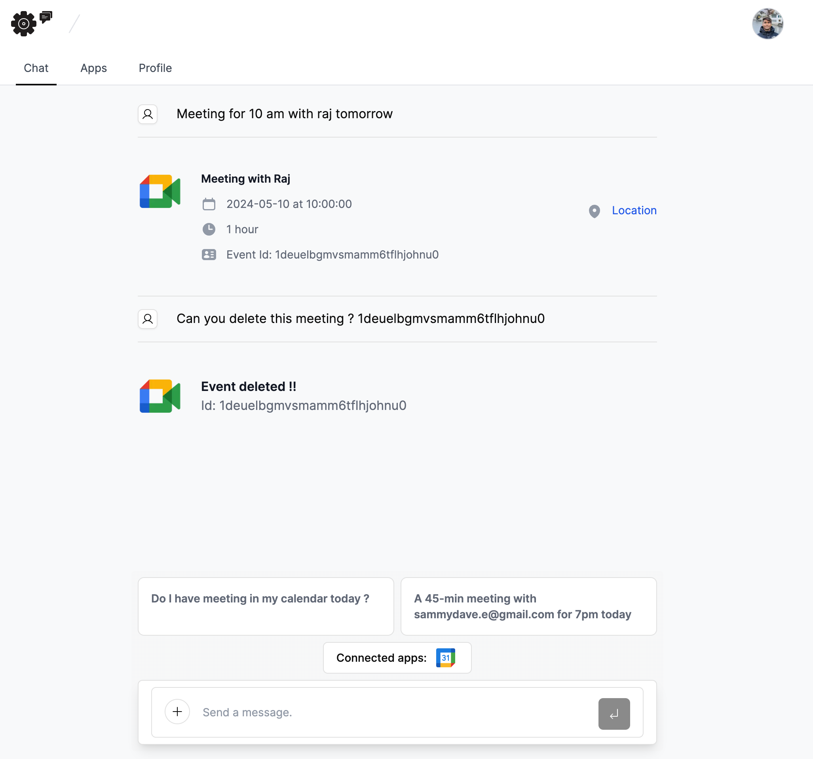

# Intro

This project is a built with the idea of making a calendar agent that could use tools inorder to communicate with your calendars. Currently only supports google calendar.

## Requirements

```bash
-   Node version 18.19.0
-   MacOS (This project was built on MacOS)
-   Windows (Should work on windows as well but havent run it)
-   Your project should be configured to run on PORT 3000
```

## Demo

Here you can check out the [Demo](https://twitter.com/rajeshdavidbabu/status/1789031872560820292) video

## Image



## Good to know

:::tip License

This project is private. Sharing with unauthorized parties is prohibited and you will be liable for prosecution if you break the terms. If you have any questions regarding this, contact me on my [x.com](https://twitter.com/rajeshdavidbabu).

:::

:::warning Debugging Errors

The project would work most-cases 90% of the time. But here and there, you might face some errors while rough-testing the project, but you can see the [debugging](/debugging) section for more information.

:::
